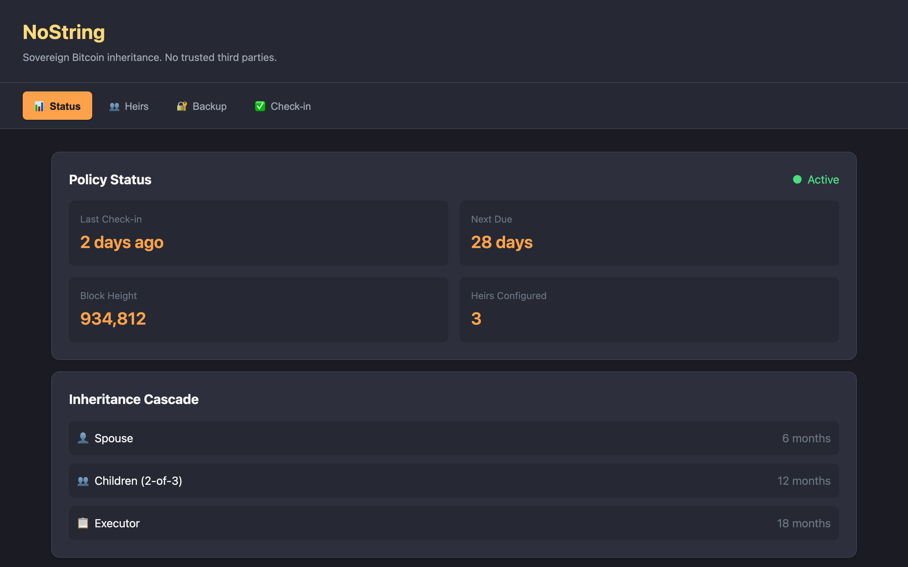

<div align="center">

# NoString

**Bitcoin inheritance without trusted third parties.**

[](https://github.com/RenAndKiwi/nostring/actions/workflows/ci.yml)
[](LICENSE)
[](#)

*Your heirs inherit your Bitcoin when you stop checking in. No custodians. No monthly fees. Just math.*

[Features](#features) • [Quick Start](#quick-start) • [How It Works](#how-it-works) • [Documentation](#documentation)

</div>

---

## The Problem

You've taken custody of your Bitcoin. But what happens to it when you die?

| Traditional Option | The Problem |
|-------------------|-------------|
| **Custodians** | They can rug you, get hacked, or go bankrupt |
| **Paper instructions** | Heirs lose access, get phished, or can't execute |
| **Lawyers & wills** | Probate courts, delays, fees—they don't understand Bitcoin |

**NoString solves this with timelocks.** Your heirs can only claim after you stop checking in. No company, no custodian, no permission needed.

---

## Features

- **👁️ Watch-Only First** — Import your xpub. Your keys never leave your hardware wallet.
- **⏱️ Timelock Inheritance** — Miniscript policies with configurable check-in periods
- **👥 Multi-Heir Cascade** — Spouse at 6 months → Children at 12 months → Executor at 18 months
- **📋 Descriptor Backup** — Download your inheritance descriptor for recovery in any miniscript wallet
- **🔑 Shamir Backup** — Split your seed with SLIP-39 or Codex32 (2-of-3, 3-of-5, etc.)
- **📱 Air-Gap Signing** — QR-based PSBT flow for hardware wallets
- **🔔 Notifications** — Nostr DM + email reminders before timelock expiry (service key → owner npub)
- **💾 Persistent State** — SQLite-backed storage; close and reopen without losing anything
- **🪪 Nostr Identity Inheritance** — Shamir-split your nsec so heirs can recover your Nostr identity after Bitcoin inheritance triggers
- **📤 Automated Heir Delivery** — Descriptor backup auto-delivered to heirs via Nostr DM + email when check-in fails
- **🔄 nsec Revocation** — Revoke and re-split Nostr identity shares if heirs change or shares are compromised
- **🔍 Spend Detection** — Witness analysis distinguishes owner check-ins from heir claims on-chain
- **🐳 Docker Self-Hosting** — Headless server daemon for 24/7 monitoring without the desktop app
- **💻 Desktop App** — Cross-platform Tauri application (macOS, Windows, Linux)
- **🔬 Fuzz-Tested** — Cargo-fuzz harnesses for all input parsing (Codex32, BIP-39, encrypted seeds)

---

## Screenshots

<div align="center">

<p><em>Dashboard showing policy status, check-in timeline, and heir cascade</em></p>
</div>

---

## Quick Start

### Run the App (Fastest)

```bash
# Install Rust (if you don't have it)
curl --proto '=https' --tlsv1.2 -sSf https://sh.rustup.rs | sh
source ~/.cargo/env

# Clone and run
git clone https://github.com/RenAndKiwi/nostring
cd nostring
cargo tauri dev
```

First run takes a few minutes to compile. The app window opens automatically.

### Prerequisites

- **Rust (latest stable)** — `rustup update stable`
- **Tauri deps** — see [Tauri prerequisites](https://v2.tauri.app/start/prerequisites/) for your OS

### Build from Source

```bash
git clone https://github.com/RenAndKiwi/nostring
cd nostring

# Run tests
cargo test

# Build release binary
cargo build --release

# Build desktop app (creates installer)
cargo tauri build
```

### Download Binary

Pre-built binaries for macOS (ARM64 + x64), Linux, and Windows are available on the [Releases](https://github.com/RenAndKiwi/nostring/releases/tag/v0.4.0) page.

### Docker (Headless Server)

```bash
# Copy and edit config
cp config/nostring-server.example.toml config/nostring-server.toml

# Run with Docker Compose
docker compose up -d
```

See [SELF_HOSTING.md](docs/SELF_HOSTING.md) for full setup.

---

## How It Works

```
┌─────────────────────────────────────────────────────────────────┐
│                                                                 │
│   Owner can spend immediately                                   │
│                         OR                                      │
│   Heir can spend after 26,280 blocks (~6 months of inactivity) │
│                                                                 │
└─────────────────────────────────────────────────────────────────┘
```

### 1. Setup
- **Import your xpub** (watch-only) — your keys stay on your hardware wallet
- **Add heirs** by importing their xpub from their own wallet
- **Configure timelock** — how long before heirs can claim (e.g. 6 months)
- NoString creates a **miniscript descriptor** combining both xpubs + timelock
- **Fund the inheritance address** generated from the descriptor
- **Download your descriptor backup** — this is your recovery key

### 2. Check-In
- Periodically sign a PSBT to prove you're alive
- Sign with your hardware wallet (QR code or copy/paste)
- This spends to a new inheritance address, resetting the timelock
- NoString prompts you to download the updated descriptor after each check-in

### 3. Inheritance
- If you stop checking in, the timelock countdown begins
- When it expires, **heirs claim using their own wallet** (their key becomes valid)
- No intermediaries, no permission, no seed sharing
- Just Bitcoin script enforced by the network

### 4. Recovery
- **You lose NoString but have your hardware wallet?** Import the descriptor backup into any miniscript wallet (Liana, Electrum) — full access restored
- **You lose your hardware wallet?** Use your Shamir backup (Codex32/SLIP-39 shares) to reconstruct your seed
- **Heir needs to claim?** They use their own wallet — no access to your seed needed

---

## Architecture

```
nostring/
├── crates/
│   ├── nostring-core      # Seed, encryption, key derivation
│   ├── nostring-inherit   # Miniscript policies, check-in builder
│   ├── nostring-shamir    # SLIP-39 and Codex32 secret sharing
│   ├── nostring-electrum  # Bitcoin network via Electrum
│   ├── nostring-notify    # Nostr DM + email notifications
│   ├── nostring-watch     # UTXO monitoring + spend analysis
│   └── nostring-server    # Headless daemon for Docker/server deployment
├── tauri-app/             # Desktop application (Rust + vanilla JS)
│   └── src-tauri/src/
│       ├── db.rs          # SQLite persistence layer
│       ├── state.rs       # AppState with write-through caching
│       └── commands.rs    # All Tauri commands
├── tests/e2e/             # Integration test suite
└── docs/                  # Documentation
```

### Dependencies

| Crate | Purpose |
|-------|---------|
| [bitcoin](https://crates.io/crates/bitcoin) | Bitcoin primitives |
| [miniscript](https://crates.io/crates/miniscript) | Policy → Script compilation |
| [electrum-client](https://crates.io/crates/electrum-client) | Electrum protocol |
| [nostr-sdk](https://crates.io/crates/nostr-sdk) | Nostr notifications |
| [tauri](https://tauri.app) | Desktop app framework |

---

## Documentation

| Document | Description |
|----------|-------------|
| [HEIR_GUIDE.md](docs/HEIR_GUIDE.md) | How heirs set up their wallet |
| [CLAIM_GUIDE.md](docs/CLAIM_GUIDE.md) | How heirs claim when the time comes |
| [SELF_HOSTING.md](docs/SELF_HOSTING.md) | Docker + server deployment guide |
| [OPERATIONS.md](docs/OPERATIONS.md) | Operational runbook |
| [NOSTR_INHERITANCE.md](docs/NOSTR_INHERITANCE.md) | Shamir-gated nsec inheritance spec |
| [SECURITY_AUDIT.md](docs/SECURITY_AUDIT.md) | Pre-audit security review |

---

## Roadmap

### v0.1 ✅ — Core Inheritance
- Watch-only wallet, timelocked policies, multi-heir cascade
- Codex32 Shamir backup, air-gap PSBT signing
- Nostr DM + email notifications, SQLite persistence
- Nostr identity inheritance (Shamir-split nsec + heir recovery)
- Cross-platform desktop app (Tauri)

### v0.2 ✅ — Hardening
- Automated descriptor delivery to heirs (Nostr DM + email escalation)
- nsec revocation and re-split flow
- Spend type detection (witness analysis: owner check-in vs heir claim)
- 31 security audit tests (crypto fuzzing, input validation, zeroization)
- Seed/key memory zeroization after use
- GF(256) panic-to-error conversion (malformed shares no longer crash)
- PSBT witness_utxo + witness_script + BIP-32 derivation paths (hardware wallet signing)
- Full 128-bit entropy for Argon2 salt
- Core dump prevention (`setrlimit RLIMIT_CORE=0`)
- Memory locking (`mlock`) for seed pages — `LockedBuffer` RAII with zeroize-on-drop
- Password entropy estimation with strength warnings
- QR libraries vendored locally (no CDN dependencies)
- Reproducible builds (pinned Rust toolchain, `--locked`, committed `Cargo.lock`)

### v0.3 ✅ — Infrastructure
- [x] Docker self-hosting (headless `nostring-server` daemon)
- [x] Nostr relay storage for locked shares (encrypted redundancy)

### v0.4 ✅ — Polish & Hardening
- [x] Dashboard UI: spend type icons, heir claim alert banner, activity log
- [x] Tagged release binaries (macOS/Win/Linux) — [v0.4.0 published](https://github.com/RenAndKiwi/nostring/releases/tag/v0.4.0)
- [x] Rustls CryptoProvider initialization (crash fix)
- [x] get_height() testnet compatibility
- [x] Wizard timelock wired to backend
- [x] Relay commands fixed (async Send issue resolved)
- [x] Async SMTP in server daemon
- [x] Real testnet check-in broadcast (txid: `c0ec27c7...`)
- [x] Email notification verified (MailHog integration test)
- [x] Cargo-fuzz infrastructure (3 fuzz targets, 0 crashes)
- [x] Nostr DM + relay storage verified on live relays

### v0.5 🔄 — Production Release
- [ ] External security audit
- [ ] Code signing (macOS notarization + Windows)
- [ ] Multi-sig heir consensus (2-of-3 heirs agree before claiming)
- [ ] Testnet mode toggle in UI

See [ROADMAP.md](docs/ROADMAP.md) for details.

---

## Security Model

| Aspect | Approach |
|--------|----------|
| **At rest** | AES-256-GCM + Argon2id key derivation |
| **In transit** | No private keys ever transmitted |
| **Signing** | Air-gapped via QR codes |
| **Network** | TLS required for Electrum |
| **Trust** | Zero—verify the math yourself |

See [SECURITY_AUDIT.md](docs/SECURITY_AUDIT.md) for the full threat model.

---

## Contributing

We welcome contributions. See [CONTRIBUTING.md](CONTRIBUTING.md).

```bash
# Run all tests
cargo test

# Run with network tests
cargo test -- --ignored

# Check formatting
cargo fmt --check

# Lint
cargo clippy --workspace
```

---

## License

BSD-3-Clause. See [LICENSE](LICENSE).

---

## Acknowledgments

- [Liana](https://wizardsardine.com/liana/) — Miniscript inheritance pioneer
- [SLIP-39](https://github.com/satoshilabs/slips/blob/master/slip-0039.md) — Shamir secret sharing spec
- [Codex32](https://github.com/BlockstreamResearch/codex32) — Human-computable checksums

---

<div align="center">

**Built by [Bitcoin Butlers](https://bitcoinbutlers.com)**

*Helping you hold your own keys—literally and metaphorically.*

</div>
